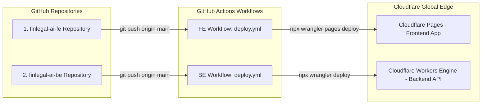

# 🛠️ FinLegal AI - Hướng Dẫn Hạ Tầng Cloudflare & Quy Trình CI/CD Phỏng Vấn (Cloudflare & CI/CD Mastery Guide)

> **Dành cho Người Học/Ứng Viên:** Tài liệu này giải thích chi tiết toàn bộ cách vận hành hạ tầng Cloudflare Serverless Edge và quy trình tự động hóa GitHub Actions CI/CD theo dạng ẩn dụ đời thực và bộ câu hỏi phỏng vấn chuẩn hóa.

---

## 💡 1. Giải Thích Hạ Tầng & CI/CD Dễ Hiểu Nhất (Real-world Analogies)

### A. Hạ Tầng Cloudflare Serverless Edge là gì?
- **Ẩn dụ đời thực:** Thay vì thuê 1 cửa hàng cố định ở Hà Nội (Server truyền thống), bạn mở **300+ đại lý nhỏ tại 300+ thành phố trên toàn thế giới** (Cloudflare Edge Network).
- **Lợi ích:**
  - Khách hàng ở Mỹ, Châu Âu hay Việt Nam mở web ra là hệ thống phục vụ ngay từ máy chủ gần họ nhất.
  - Tốc độ tải trang và phản hồi cực nhanh (**dưới 50ms**).
  - Không cần lo sập server khi có hàng triệu người truy cập cùng lúc (Tự động co giãn/Autoscaling).

### B. Quy Trình CI/CD (GitHub Actions) là gì?
- **Ẩn dụ đời thực:** Giống như một **Dây Chuyền Lắp Ráp Ô Tô Tự Động**.
- **Cách thủ công (Không có CI/CD):** Mỗi lần sửa code, bạn phải tự chạy build trên máy cá nhân, nén file zip rồi tải lên máy chủ thủ công (Rất tốn thời gian và dễ sót lỗi).
- **Cách tự động (CI/CD với GitHub Actions):**
  - **CI (Continuous Integration - Tự động kiểm tra):** Ngay khi bạn gõ `git push`, GitHub Actions tự tạo 1 máy tính ảo để chạy thử lệnh `npm run typecheck` xem code có lỗi syntax không.
  - **CD (Continuous Deployment - Tự động phát hành):** Nếu không có lỗi, hệ thống tự động đẩy mã nguồn mới lên mạng lưới Cloudflare toàn cầu trong **15 giây**.

---

## 🏗️ 2. Mô Hình 2 Repositories Độc Lập (2-Repo Architecture)

Hệ thống FinLegal AI được chia tách thành **2 Repository độc lập hoàn toàn** để đảm bảo tính bảo mật và tách biệt trách nhiệm:



---

## ⚙️ 3. Các Bước Cấu Hình Từ Đầu Đến Cuối (Step-by-Step Setup)

### Bước 1: Khởi Tạo 2 Mã Bí Mật บน GitHub Secrets
Trên cả 2 Repositories (`finlegal-ai-fe` & `finlegal-ai-be`), truy cập:  
`Settings` $\rightarrow$ `Secrets and variables` $\rightarrow$ `Actions` $\rightarrow$ Thêm 2 Secrets:

| Tên Secret | Mô Tả & Ý Nghĩa |
| :--- | :--- |
| `CLOUDFLARE_API_TOKEN` | Mã chìa khóa cấp quyền cho GitHub được phép đẩy code lên tài khoản Cloudflare của bạn. |
| `CLOUDFLARE_ACCOUNT_ID` | Mã định danh tài khoản Cloudflare của bạn (`78eede6ec04d52fe8b367f14cecb7c08`). |

---

### Bước 2: File Cấu Hình Workflow CI/CD Chi Tiết

#### A. Workflow Frontend (`finlegal-ai-fe/.github/workflows/deploy.yml`)
```yaml
name: Deploy FinLegal AI Frontend Pages

on:
  push:
    branches:
      - main # Chạy tự động mỗi khi push code lên nhánh main

jobs:
  deploy:
    name: Build & Deploy Next.js to Cloudflare Pages
    runs-on: ubuntu-latest # Tạo máy tính ảo Ubuntu Linux trên GitHub

    steps:
      - name: Checkout Code
        uses: actions/checkout@v4

      - name: Setup Node.js 22
        uses: actions/setup-node@v4
        with:
          node-version: 22
          cache: 'npm'

      - name: Install Dependencies
        run: npm install

      - name: Run TypeScript Check (CI)
        run: npm run typecheck

      - name: Build Next.js Production Bundle
        run: npm run build
        env:
          NEXT_PUBLIC_BACKEND_URL: https://finlegal-backend.lvthanh-work.workers.dev
          NEXT_PUBLIC_TURNSTILE_SITE_KEY: 0x4AAAAAAENuyoUuTRh2b7uR

      - name: Deploy to Cloudflare Pages (CD)
        run: npx wrangler pages deploy out --project-name=finlegal-ai
        env:
          CLOUDFLARE_API_TOKEN: ${{ secrets.CLOUDFLARE_API_TOKEN }}
          CLOUDFLARE_ACCOUNT_ID: ${{ secrets.CLOUDFLARE_ACCOUNT_ID }}
```

#### B. Workflow Backend (`finlegal-ai-be/.github/workflows/deploy.yml`)
```yaml
name: Deploy FinLegal AI Backend Worker

on:
  push:
    branches:
      - main

jobs:
  deploy:
    name: Typecheck & Deploy Worker to Cloudflare
    runs-on: ubuntu-latest

    steps:
      - name: Checkout Code
        uses: actions/checkout@v4

      - name: Setup Node.js 22
        uses: actions/setup-node@v4
        with:
          node-version: 22
          cache: 'npm'

      - name: Install Dependencies
        run: npm install

      - name: Run TypeScript Check (CI)
        run: npm run typecheck

      - name: Deploy Worker to Cloudflare Production (CD)
        run: npx wrangler deploy --minify
        env:
          CLOUDFLARE_API_TOKEN: ${{ secrets.CLOUDFLARE_API_TOKEN }}
          CLOUDFLARE_ACCOUNT_ID: ${{ secrets.CLOUDFLARE_ACCOUNT_ID }}
```

---

## 🎯 4. Bộ Câu Hỏi & Trả Lời Phỏng Vấn CI/CD (Interview Q&A Flashcards)

### ❓ Q1: "Bạn đã thiết lập CI/CD cho dự án như thế nào?"
> **💡 Gợi ý trả lời:**  
> *"Em thiết lập quy trình CI/CD tự động 100% bằng **GitHub Actions** cho cả 2 Repositories Frontend và Backend:*  
> *- **Bước CI (Continuous Integration):** Mỗi khi em thực hiện `git push` lên nhánh `main`, GitHub Actions sẽ tự động dựng môi trường Node.js 22, cài đặt thư viện và chạy `npm run typecheck` để phát hiện sớm các lỗi cú pháp TypeScript.*  
> *- **Bước CD (Continuous Deployment):** Nếu bước CI thành công, Workflow sẽ tự động đóng gói ứng dụng và dùng công cụ `wrangler` để deploy trực tiếp lên **Cloudflare Pages** (cho Frontend) và **Cloudflare Workers** (cho Backend) thông qua `CLOUDFLARE_API_TOKEN` bảo mật trong GitHub Secrets.*  
> *Toàn bộ quy trình từ lúc push code đến khi ứng dụng chạy trên production chỉ mất khoảng 15 giây."*

---

### ❓ Q2: "Tại sao bạn lại tách dự án thành 2 Repositories riêng biệt thay vì làm Monorepo?"
> **💡 Gợi ý trả lời:**  
> *"Em chọn tách thành 2 Repositories độc lập (`finlegal-ai-fe` và `finlegal-ai-be`) vì 3 nguyên tắc thiết kế phần mềm:*  
> *1. **Độc Lập Triển Khai (Decoupled Deployment):** Sửa lỗi giao diện Frontend thì chỉ cần deploy Frontend, không ảnh hưởng hay rủi ro làm sập Worker Backend.*  
> *2. **Bảo Mật Quyền Truy Cập (Security & Access Control):** Dễ dàng phân quyền nhóm lập trình viên (Ví dụ: Dev Frontend chỉ có quyền trên Repo Frontend).*  
> *3. **Quy Trình CI/CD Nhanh Gọn:** Giúp luồng GitHub Actions của từng bên chạy cực kỳ nhẹ, không bị chồng chéo môi trường."*

---

### ❓ Q3: "Làm thế nào để bạn bảo mật các tham số nhạy cảm (API Keys, Token) trong quy trình CI/CD?"
> **💡 Gợi ý trả lời:**  
> *"Em tuân thủ tuyệt đối quy tắc **Zero Hardcoding** (Không ghi cứng mật khẩu trong code):*  
> *- Tất cả các khóa bảo mật như `CLOUDFLARE_API_TOKEN`, `TURNSTILE_SECRET_KEY`, hay `GEMINI_API_KEY` đều được lưu trữ trong **GitHub Repository Secrets** hoặc môi trường mã hóa của Cloudflare Worker Environment Variables.*  
> *- Khi chạy GitHub Actions, các biến này được nạp động vào tiến trình chạy thông qua cú pháp `${{ secrets.CLOUDFLARE_API_TOKEN }}` nên hoàn toàn không bị lộ ra mã nguồn công khai."*
