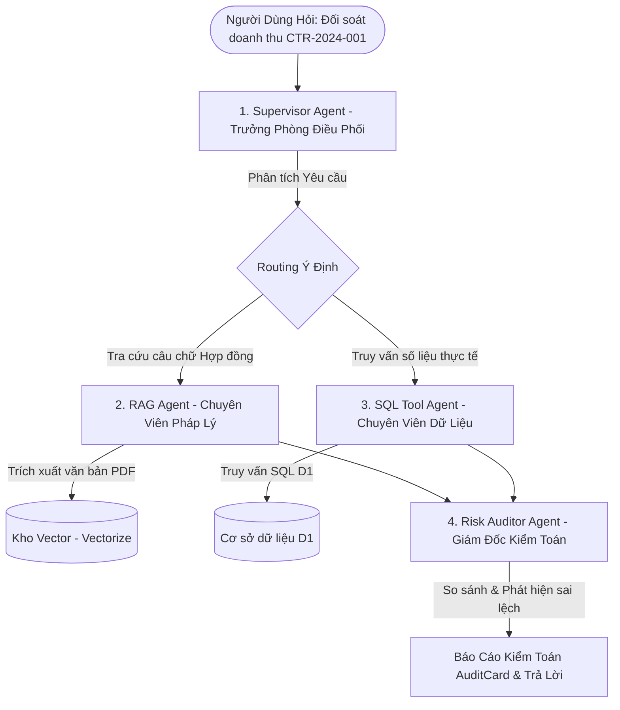

# 📘 FinLegal AI - Tài Liệu Kiến Trúc Hệ Thống & Bộ Thẻ Trả Lời Phỏng Vấn (System Architecture & Interview Guide)

> **Dành cho Người Học/Ứng Viên:** Tài liệu này được thiết kế theo ngôn ngữ dễ hiểu nhất, đi kèm ẩn dụ đời thực và bộ câu hỏi phỏng vấn thực chiến giúp bạn nắm chắc 100% bản chất hệ thống FinLegal AI để tự tin trả lời bất kỳ nhà tuyển dụng nào.

---

## 💡 1. Giải Thích Khái Niệm Dễ Hiểu Nhất (Real-world Analogies)

### A. RAG (Retrieval-Augmented Generation) là gì?
- **Ẩn dụ đời thực:** Giống như một học sinh đi thi được **Mở Sách Tra Cứu**.
- **Cách cũ (Không dùng RAG):** Bắt AI học thuộc lòng toàn bộ văn bản. Khi văn bản cập nhật hoặc có hợp đồng mới, AI không biết hoặc bị hiện tượng "Ảo giác" (nói mò, bịa ra thông tin).
- **Cách dùng RAG (Hệ thống của chúng ta):** AI **KHÔNG CẦN HỌC THUỘC**. Mỗi khi người dùng hỏi, hệ thống sẽ:
  1. **Retrieval (Tra cứu):** Mở kho tài liệu, rút ra đúng 3 - 5 đoạn văn bản liên quan nhất.
  2. **Augmented (Bổ sung context):** Kèm các đoạn văn bản đó vào câu hỏi của người dùng.
  3. **Generation (Sinh phản hồi):** Đưa cho AI đọc và tổng hợp câu trả lời chuẩn xác 100%.

### B. Kiến Trúc Đa Tác Vụ (Multi-Agent Architecture) là gì?
- **Ẩn dụ đời thực:** Giống như một **Phòng Kiểm Toán Tài Chính Doanh Nghiệp** gồm 4 chuyên gia phối hợp:



1. 🕵️‍♂️ **Supervisor Agent (Trưởng phòng Điều phối):** Đọc câu hỏi người dùng, phân tích xem câu hỏi này cần tra hợp đồng PDF (RAG), cần truy vấn số liệu DB (SQL), hay cần cả hai (Hybrid).
2. 📄 **Advanced RAG Agent (Chuyên viên Pháp lý):** Tìm kiếm câu chữ, điều khoản ghi nhận doanh thu trong các file PDF Hợp đồng đã tải lên.
3. 📊 **SQL Tool Agent (Chuyên viên Dữ liệu):** Tự động soi cấu trúc Database và viết câu lệnh SQL để lấy số liệu doanh thu thực tế ghi nhận trong hệ thống D1.
4. ⚖️ **Risk Auditor Agent (Giám đốc Kiểm toán):** So sánh con số trong Hợp đồng PDF với con số thực tế trong Database SQL. Nếu phát hiện sai lệch (ví dụ: Hợp đồng ghi $150,000 nhưng DB ghi $120,000), lập tức tính tỷ lệ % lệch và cảnh báo Rủi ro Rất Cao (HIGH RISK)!

---

## 🚀 2. Ngăn Xếp Công Nghệ & Lý Do Chọn (Tech Stack & Justifications)

| Thành Phần | Công Nghệ Sử Dụng | Lý Do Lựa Chọn (Trả lời Phỏng vấn) |
| :--- | :--- | :--- |
| **Frontend** | **Next.js 14 (React)** | Framework hiện đại nhất, hỗ trợ Render giao diện nhanh, tương thích tốt với Cloudflare Pages. |
| **Backend Engine** | **Hono.js trên Cloudflare Workers** | Framework Serverless siêu nhẹ, thời gian khởi động **0ms (Zero Cold Start)**, hỗ trợ luồng dữ liệu thời gian thực **Server-Sent Events (SSE)**. |
| **Relational DB** | **Cloudflare D1 (SQLite Edge)** | Cơ sở dữ liệu SQL phân tán ngay tại mạng lưới Edge, độ trễ cực thấp (<10ms). |
| **Vector DB** | **Cloudflare Vectorize** | Kho lưu trữ Vector 768 chiều tối ưu riêng cho bài toán RAG tìm kiếm ngữ nghĩa. |
| **Object Storage** | **Cloudflare R2** | Kho lưu trữ file PDF nguyên bản với **0$ phí truyền tải dữ liệu (No Egress Fees)**. |
| **LLM & Embeddings** | **Cloudflare Workers AI** | Chạy trực tiếp các mô hình AI Llama-3.1 8B & BGE-Base Embeddings trên hạ tầng GPU Edge. |
| **Bảo Mật Anti-Bot** | **Cloudflare Turnstile** | Giải pháp xác thực chính chủ chống Bot độc hại không cần người dùng bấm hình ảnh phiền phức. |

---

## 🎯 3. Bộ Câu Hỏi & Trả Lời Phỏng Vấn Thực Chiến (Interview Q&A Flashcards)

### ❓ Q1: "Hãy giới thiệu về kiến trúc của dự án FinLegal AI mà bạn đã làm?"
> **💡 Gợi ý trả lời:**  
> *"Dự án FinLegal AI là hệ thống trợ lý AI hỗ trợ phân tích Hợp đồng và Đối soát số liệu bán hàng doanh nghiệp. Em xây dựng dự án theo kiến trúc **Serverless Edge trên Cloudflare** kết hợp **Multi-Agent RAG**:*  
> *- **Frontend:** Viết bằng Next.js 14, giao diện Theme Sáng tối giản, kết nối SSE để nhận phản hồi dạng Streaming.*  
> *- **Backend:** Sử dụng Hono.js chạy trên Cloudflare Workers. Hệ thống gồm 4 Agent chuyên biệt: **Supervisor Agent** (điều phối ý định), **RAG Agent** (trích xuất điều khoản PDF từ Cloudflare Vectorize), **SQL Agent** (truy vấn số liệu từ D1 Database), và **Risk Auditor Agent** (đối soát sai lệch và lập báo cáo rủi ro).*  
> *- Toàn bộ hệ thống chạy 100% trên hạ tầng Serverless Edge nên độ trễ cực kỳ thấp và chi phí vận hành gần như bằng 0."*

---

### ❓ Q2: "Tại sao bạn không gửi trực tiếp tệp PDF cho LLM đọc mà phải làm RAG và Vector Database?"
> **💡 Gợi ý trả lời:**  
> *"Có 3 lý do kỹ thuật quan trọng khiến em chọn giải pháp RAG:*  
> *1. **Chi Phí & Tốc Độ:** Nếu gửi nguyên file PDF 50 trang mỗi lần hỏi, chi phí Token sẽ cực kỳ đắt và thời gian phản hồi rất chậm (10-15s). RAG giúp trích xuất đúng 3-5 đoạn liên quan nhất (~500 tokens), phản hồi chỉ mất 1-2s.*  
> *2. **Khả Năng Mở Rộng (Scale):** Mô hình RAG cho phép lưu trữ và tra cứu cùng lúc hàng nghìn Hợp đồng trong Vectorize, điều mà Context Window của LLM không thể làm được.*  
> *3. **Độ Chính Xác & Kiểm Toán:** RAG cho phép trích xuất chính xác con số và số trang trong Hợp đồng để Agent SQL đối soát 1-1 với Database thực tế, tránh hoàn toàn hiện tượng AI nói bịa (Hallucination)."*

---

### ❓ Q3: "Luồng dữ liệu (Data Flow) khi người dùng tải lên một file PDF diễn ra như thế nào?"
> **💡 Gợi ý trả lời:**  
> *"Khi người dùng tải lên một file PDF Hợp đồng:*  
> *1. File nhị phân được lưu trữ nguyên bản vào **Cloudflare R2 Storage**.*  
> *2. Backend chạy thuật toán **PDF Text Stream Extractor** để bóc tách toàn bộ chữ và bảng biểu.*  
> *3. Văn bản được cắt thành các đoạn nhỏ (Chunks ~1000 ký tự) nhờ bộ **Table-Preserving Chunker** để giữ nguyên cấu trúc bảng.*  
> *4. Mỗi chunk được chuyển thành chuỗi Vector 768 chiều bằng mô hình **Workers AI BGE-Base Embeddings** và lưu vào **Cloudflare Vectorize**.*  
> *5. Đồng thời, thông tin văn bản được lưu vào cơ sở dữ liệu **Cloudflare D1** để hiển thị lên danh sách tài liệu."*

---

### ❓ Q4: "Cách bạn xử lý giao tiếp thời gian thực (Real-time Streaming) giữa Frontend và Backend?"
> **💡 Gợi ý trả lời:**  
> *"Em sử dụng công nghệ **Server-Sent Events (SSE)** thay vì WebSocket hay Polling truyền thống:*  
> *- SSE sử dụng giao thức HTTP đơn giản, cực kỳ nhẹ và tương thích hoàn hảo với kiến trúc Serverless Edge của Cloudflare Workers.*  
> *- Backend phát ra các sự kiện theo thời gian thực như `event: thought` (báo cáo bước suy luận của Agent), `event: audit_report` (kết quả đối soát), và `event: final_answer` (câu trả lời hoàn chỉnh).*  
> *- Ở Frontend, em viết Custom Hook `useSSE` để nhận dữ liệu dòng và cập nhật UI mượt mà mà không bị kẹt xoay Loading."*

---

## 📁 4. Sơ Đồ Cấu Trúc Mã Nguồn (Directory Tree)

```text
finlegal-ai/
├── finlegal-ai-fe/                # FRONTEND (Next.js 14 Cloudflare Pages)
│   ├── src/
│   │   ├── app/
│   │   │   ├── layout.tsx         # Root Layout & Turnstile Script
│   │   │   └── page.tsx           # Main Page & Full-Screen Security Gate
│   │   ├── components/
│   │   │   ├── SecurityGate.tsx   # Cổng bảo mật Turnstile toàn màn hình
│   │   │   ├── Header.tsx         # Thanh tiêu đề thương hiệu chính
│   │   │   ├── FileUpload.tsx     # Khung tải tệp PDF Hợp đồng
│   │   │   ├── PDFViewer.tsx      # Quản lý & Nút Xóa danh sách tài liệu
│   │   │   ├── ChatWindow.tsx     # Cửa sổ trò chuyện & đối soát AI
│   │   │   ├── ThoughtProcess.tsx # Accordion hiển thị từng bước suy luận Agent
│   │   │   └── AuditCard.tsx      # Thẻ hiển thị kết quả kiểm toán rủi ro
│   │   └── hooks/
│   │       └── useSSE.ts          # Custom SSE Hook xử lý kết nối dữ liệu dòng
│
└── finlegal-ai-be/                # BACKEND (Hono.js Cloudflare Workers Engine)
    ├── src/
    │   ├── index.ts               # File chạy chính API, Middleware & Routes
    │   ├── agents/
    │   │   ├── supervisor.ts      # SupervisorAgent (Phân loại & Định tuyến)
    │   │   ├── ragAgent.ts        # AdvancedRAGAgent (Tra cứu Vectorize)
    │   │   ├── sqlAgent.ts        # SQLToolAgent (Truy vấn D1 Database)
    │   │   └── auditor.ts         # RiskAuditorAgent (Đối soát sai lệch)
    │   ├── services/
    │   │   ├── llm.ts             # Service quản lý LLM & Fallback Models
    │   │   ├── vectorize.ts       # Service tương tác Cloudflare Vectorize
    │   │   ├── d1.ts              # Service tương tác D1 Database
    │   │   └── chunker.ts         # Cắt đoạn văn bản bảo toàn bảng biểu
    │   └── utils/
    │       └── pdfExtractor.ts    # Bóc tách chữ từ tệp PDF nhị phân
```
