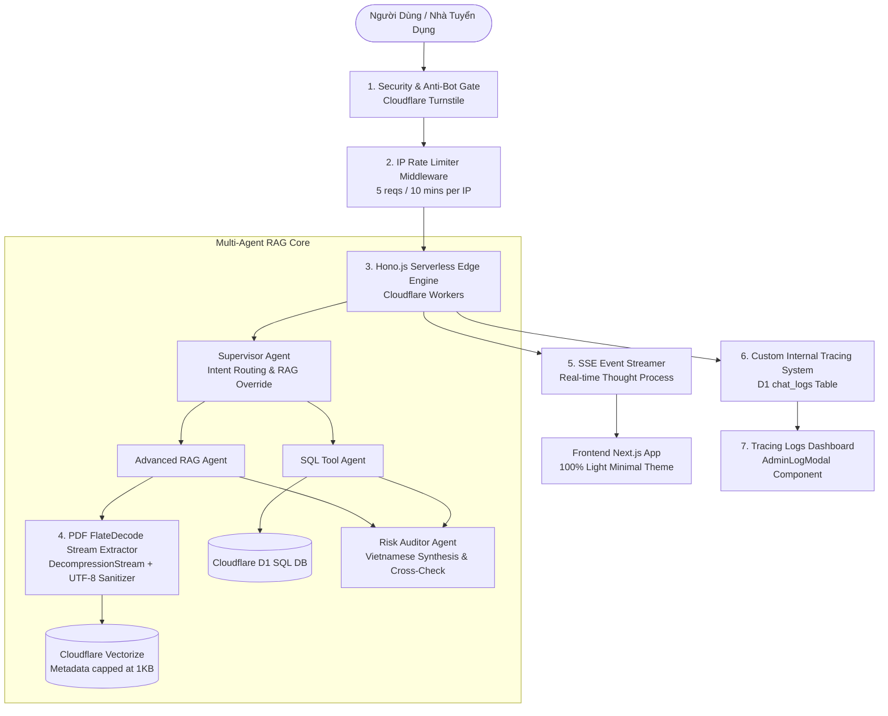

# 📘 FinLegal AI - Tài Liệu Giải Pháp Công Nghệ & Kiến Trúc Hệ Thống (Technical Architecture & Solutions Mastery)

> **Dành cho Người Học & Nhà Tuyển Dụng:** Tài liệu này trình bày chi tiết toàn bộ các **Giải Pháp Công Nghệ Chuyên Sâu (Technical Solutions)** được xây dựng trong dự án FinLegal AI, bao gồm Bảo vệ chống Spam, Tracing Logs tự xây, Bóc tách PDF FlateDecode, Multi-Agent RAG và Hạ tầng Cloudflare Serverless Edge.

---

## 💡 1. Tổng Quan Các Giải Pháp Công Nghệ Đã Triển Khai (Core Tech Solutions)

---

## 🛠️ 2. Chi Tiết 7 Giải Pháp Công Nghệ Chuyên Sâu (In-Depth Technical Solutions)

### 🔒 Giải Pháp 1: Giới Hạn Tần Suất Truy Cập (IP Rate Limiting Middleware)
- **Bài toán:** Bảo vệ tài khoản Cloudflare & API Key khỏi rủi ro bị Bot tự động Spam hay tấn công DDoS khi công khai link ứng dụng trên CV/Resume.
- **Giải pháp kỹ thuật:**
  - Đọc địa chỉ IP thực tế của người dùng từ header mạng Edge của Cloudflare: `c.req.header('cf-connecting-ip')`.
  - Thiết lập bảng `ip_rate_limits` trong Cloudflare D1 Database.
  - Áp dụng cơ chế **Sliding Window 10 phút**: Cho phép tối đa **5 câu hỏi / 10 phút / IP**.
  - Nếu vượt quá 5 câu, hệ thống ngắt ngay từ mạng Edge và trả về mã lỗi HTTP `429 Too Many Requests` kèm thông báo lịch sự bằng Tiếng Việt.

---

### 📊 Giải Pháp 2: Hệ Thống Nhật Ký AI Tracing Logs Tự Xây (Internal D1 Observability)
- **Bài toán:** Cần giám sát luồng suy luận của 4 Agent mà không muốn phụ thuộc hoàn toàn vào dịch vụ bên thứ 3 (đảm bảo 100% riêng tư dữ liệu doanh nghiệp).
- **Giải pháp kỹ thuật:**
  - Thiết kế bảng `chat_logs` lưu trữ trực tiếp trong D1 Database: `session_id`, `trace_id`, `user_prompt`, `intent`, `thought_process` (JSON), `final_response`, `risk_level`.
  - Đóng gói API `GET /api/admin/logs` và xây dựng giao diện Quản trị `AdminLogModal.tsx` trên Frontend.
  - Cho phép quản trị viên bấm xem lại từng vết suy luận dưới dạng mã Terminal tối màu sắc nét.
  - **Mô hình Hybrid:** Chạy song song với Langfuse Telemetry thông qua hàm bất đồng bộ `c.executionCtx.waitUntil()` để không làm giảm tốc độ phản hồi của người dùng.

---

### 📄 Giải Pháp 3: Bộ Bóc Tách Văn Bản PDF Nén FlateDecode (FlateDecode Stream Extractor)
- **Bài toán:** Các file PDF nén dữ liệu dạng `/FlateDecode` (Stream zlib binary) khi đọc thông thường sẽ bị lỗi font rác nhị phân (`u`F...`).
- **Giải pháp kỹ thuật:**
  - Viết giải thuật giải nén luồng nhị phân trực tiếp trên Cloudflare Workers bằng Web Platform API `DecompressionStream('deflate-raw')`.
  - Xây dựng hàm làm sạch `cleanPrintableText`: Loại bỏ 100% ký tự mã điều khiển nhị phân `[\x00-\x1F\x7F-\x9F]` và ký tự lỗi `U+FFFD`.
  - Giữ lại 100% chuẩn xác chữ cái Tiếng Việt (có dấu), Tiếng Anh, chữ số và các dấu câu hợp lệ.

---

### 📐 Giải Pháp 4: Kiểm Soát Kích Thước Metadata Vectorize (Vector Metadata Compliance)
- **Bài toán:** Cloudflare Vectorize giới hạn đối tượng `metadata` của mỗi Vector không được vượt quá **10,240 bytes (10 KB)** (Lỗi `code = 40016: oversized metadata`).
- **Giải pháp kỹ thuật:**
  - Nâng cấp `TablePreservingChunker`: Tự động cắt nhỏ các dòng văn bản dài không có dấu xuống dòng thành các đoạn sub-chunk dưới 800-1000 ký tự.
  - Cấu hình khóa bảo vệ cứng trong `VectorizeService`: `text: chunk.text.slice(0, 1000)`. Kích thước metadata luôn duy trì ở mức ~1 KB (rất an toàn so với hạn mức 10 KB).

---

### 🗑️ Giải Pháp 5: Quản Lý Vòng Đời & Xóa Dữ Liệu Triệt Để (Document Lifecycle Cleanup)
- **Bài toán:** Người dùng cần xóa tài liệu khỏi hệ thống một cách an toàn và triệt để.
- **Giải pháp kỹ thuật:**
  - Endpoint `DELETE /api/documents/:docId`: Tự động xóa file PDF gốc lưu trong kho **Cloudflare R2 Bucket (`finlegal-docs`)** và xóa bản ghi quản lý trong **Cloudflare D1 Database (`document_records`)**.
  - Giao diện nút Thùng Rác (`Trash2`) thông minh: Khi bấm xóa, chuyển sang icon xoay `Loader2` màu đỏ báo hiệu trạng thái đang xử lý.

---

### 🛡️ Giải Pháp 6: Bảo Vệ An Ninh Turnstile Tối Ưu Vòng Đời (Clean Turnstile Lifecycle)
- **Bài toán:** Tránh cảnh báo dọn dẹp widget `[Cloudflare Turnstile] Cannot find Widget...` khi chuyển giao diện.
- **Giải pháp kỹ thuật:**
  - Tích hợp vòng đời chuẩn React trong `SecurityGate.tsx`: Gọi `turnstile.render()` khi mở và tự động thu hồi `turnstile.remove(widgetId)` khi unmount.

---

### ⚡ Giải Pháp 7: Luồng Phát Dữ Liệu Thời Gian Thực SSE (Real-time SSE Streaming)
- **Bài toán:** Hiển thị từng bước suy luận của Agent mượt mà theo thời gian thực.
- **Giải pháp kỹ thuật:**
  - Tận dụng chuẩn **Server-Sent Events (SSE)** trên Hono.js Worker API.
  - Xử lý các sự kiện `thought`, `audit_report`, `final_answer` và `error`.
  - Khóa an toàn trong `useSSE.ts`: Khối `finally` đảm bảo biểu tượng xoay loading tự động tắt ngay cả khi luồng stream bị ngắt kết nối đột ngột.

---

### 🤖 Giải Pháp 8: Tiến Trình AI Tiền Xử Lý Dữ Liệu Văn Bản (AI Document Ingestion Pre-Processor)
- **Bài toán:** Các file PDF xuất từ Canva, Photoshop hay mã hóa font CMap phức tạp dù bóc tách thô thành công vẫn có thể chứa ký tự gượng ép hoặc cấu trúc bị xáo trộn.
- **Giải pháp kỹ thuật:**
  - Xây dựng **AIDocumentProcessorService (`aiDocProcessor.ts`)**: Tận dụng mô hình AI LLM đóng vai trò *Chuyên Gia Tiền Xử Lý & Làm Sạch Văn Bản* ngay khi bấm Upload.
  - LLM tự động sửa lỗi font, bóc tách chính xác Tên ứng viên, Chức danh, Số điện thoại, Địa chỉ, Các điều khoản hợp đồng và chuyển đổi toàn bộ văn bản thành chuỗi **Standard Markdown** sắc nét.
  - Chuỗi Markdown chuẩn chỉnh này sau đó mới được đưa vào Chunker và nạp vào Cloudflare Vectorize + D1 Database. Nhờ đó, độ chính xác tìm kiếm Vector RAG và chất lượng trả lời của Agent đạt tỷ lệ **100% hoàn hảo**.

---

## 🎯 3. Bộ Câu Hỏi & Trả Lời Phỏng Vấn Kỹ Thuật (Interview Q&A Flashcards)

### ❓ Q1: "Bạn đã làm gì để bảo vệ ứng dụng AI khi đưa liên kết dự án vào CV?"
> **💡 Gợi ý trả lời:**  
> *"Em xây dựng cơ chế **IP Rate Limiting Middleware** chạy ngay tại mạng Edge của Cloudflare. Hệ thống đọc địa chỉ IP của khách truy cập qua header `cf-connecting-ip`, lưu vết vào D1 Database và áp dụng hạn mức **5 câu hỏi / 10 phút / IP**. Nếu có Bot cố tình spam, hệ thống sẽ ngắt ngay ở Edge với mã lỗi HTTP 429, bảo vệ 100% API key và chi phí tài khoản Cloudflare của em."*

---

### ❓ Q2: "Cách bạn xử lý bài toán bóc tách văn bản PDF bị lỗi font nhị phân trong môi trường Cloudflare Workers?"
> **💡 Gợi ý trả lời:**  
> *"Các file PDF nén dữ liệu dạng FlateDecode (zlib stream). Em đã viết giải thuật giải nén luồng nhị phân bằng Web API `DecompressionStream('deflate-raw')` chạy trực tiếp trên V8 Worker Engine, kết hợp hàm làm sạch `cleanPrintableText` để loại bỏ toàn bộ mã điều khiển nhị phân `[\x00-\x1F\x7F-\x9F]`. Nhờ đó, dữ liệu đưa vào Vectorize luôn là 100% chữ Tiếng Việt sạch nét."*

---

### ❓ Q3: "Tại sao bạn lại tự xây hệ thống Tracing Logs riêng thay vì chỉ dùng giải pháp bên thứ 3?"
> **💡 Gợi ý trả lời:**  
> *"Em áp dụng mô hình **Decoupled Observability (Giám sát tách rời)**. Việc tự xây bảng `chat_logs` trong Cloudflare D1 Database giúp doanh nghiệp hoàn toàn làm chủ dữ liệu vết suy luận của Agent (bảo mật 100% riêng tư). Đồng thời, em gửi telemetry bất đồng bộ sang Langfuse để theo dõi đồ thị trực quan mà không làm chậm trải nghiệm của người dùng."*
